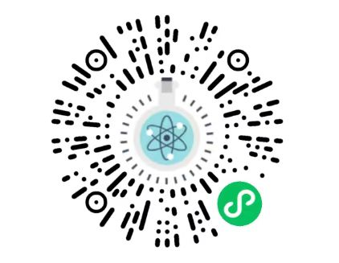
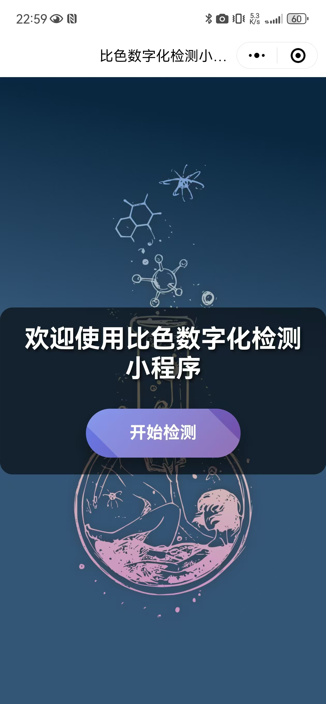
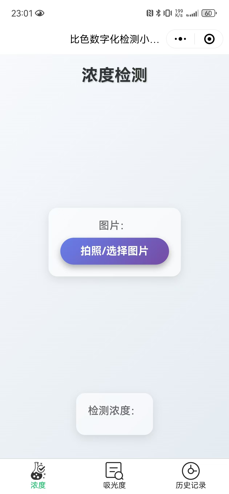
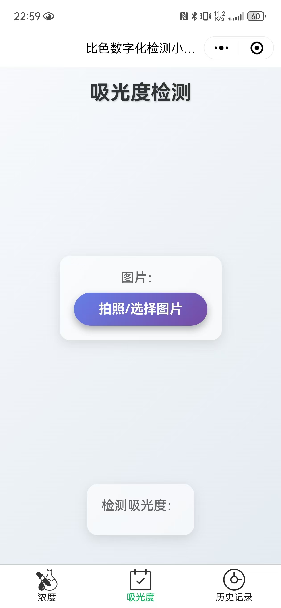
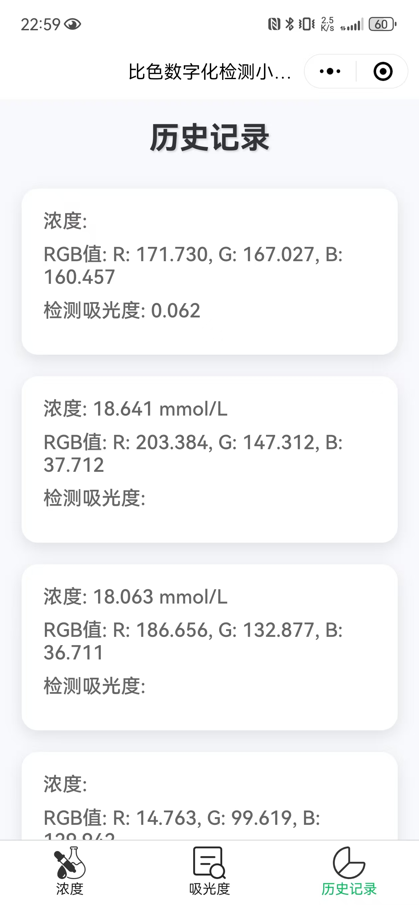
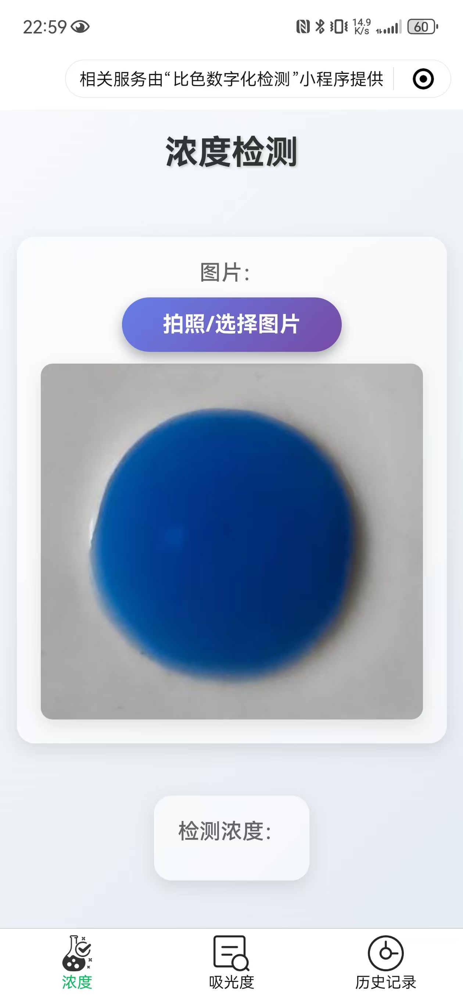
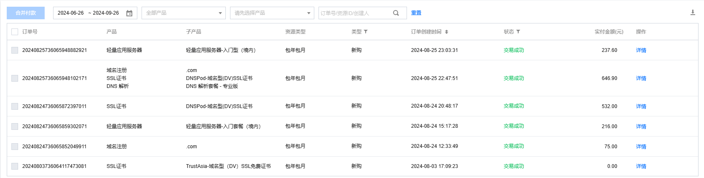
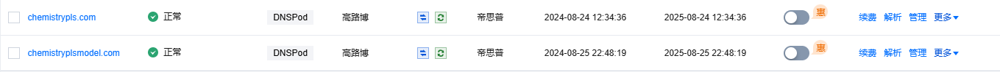
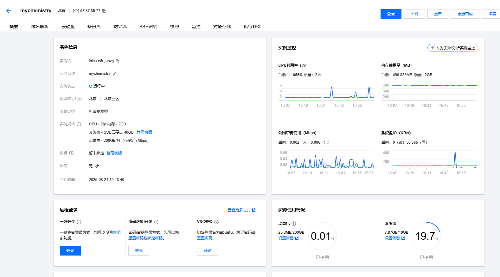
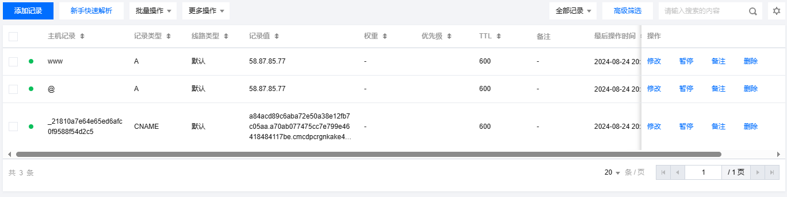

# Chemistry PLS 微信小程序

> “微瑞杯”第五届全国大学生化学实验创新设计大赛-实验数字化设计竞赛中的参赛作品的一部分

**Chemistry PLS 微信小程序** 项目旨在借助偏最小二乘回归模型，将有机染料（甲基橙和亚甲基蓝）溶液照片的RGB颜色提取与数学建模相结合，在后端服务器协同下，客户端通过微信小程序可快速获取溶液浓度。项目包含前端（微信小程序）和后端（Python Flask 服务器）组件。

ICP备案/许可号：[津ICP备2024023054号-1X](https://beian.miit.gov.cn/)）


## 目录

- [项目简介](#项目简介)
- [使用的技术](#使用的技术)
- [安装和设置](#安装和设置)
  - [后端设置](#后端设置)
  - [微信小程序设置](#微信小程序设置)
- [如何使用](#如何使用)
- [未来开发计划](#未来开发计划)
- [许可证](#许可证)

## 项目简介

Chemistry PLS 微信小程序通过分析用户上传的图片，提取出图片中心区域的RGB值，利用PLS回归模型识别出化学试剂的浓度和吸光度。前端由微信小程序实现，用户可以拍摄或上传图片，后端服务器基于PLS回归模型进行分析并返回结果。

小程序二维码如下：



## 页面效果

### 0 进入页面



### 1 浓度检测页面



### 2 吸光度检测页面



### 3 历史记录页面



### 4 检测结果展示




## 使用的技术

- **前端**: 微信小程序
- **后端**: Python, Flask
- **模型**: 偏最小二乘回归（PLS）
- **服务器**: Nginx, Gunicorn
- **其他**: 腾讯云域名, SSL证书


## 安装和设置

### 一、后端腾讯云轻量服务器设置

1. **更新系统包**：

   ```bash
   sudo apt update
   sudo apt upgrade -y
   ```

2. **安装Certbot——自动域名获取`HTTPS`证书**：

   ```bash
   sudo apt install certbot python3-certbot-nginx -y
   ```

3. **进入项目目录并创建虚拟环境**:

   ```bash
   python3 -m venv myenv
   source /home/lighthouse/myenv/bin/activate  # 激活虚拟环境
   cd /home/lighthouse/myenv/codes
   ```

4. **克隆代码库（也可直接手动上传代码）**：

   ```
   sudo apt install git -y
   git clone https://github.com/globe01/Chemistry_PLS_Wechat_Program.git
   ```

5. **安装依赖**:

   ```bash
   pip install -r requirements.txt
   ```

   或者

   ```bash
   sudo apt install nginx -y
   sudo apt-get install -y libgl1
   ```

   ```bash
   pip install -i https://mirrors.cloud.tencent.com/pypi/simple/ flask joblib numpy pandas scikit-learn==1.5.0 flask-cors opencv-python gunicorn
   ```

6. **启动Flask服务器**:

   ```bash
   nohup gunicorn -w 4 -b 0.0.0.0:5000 app:app &
   ```

7. **Nginx 服务器 SSL 证书安装部署（Linux）**

   在[SSL 证书控制台](https://console.cloud.tencent.com/ssl)选择需要安装的证书并单击下载：

   **文件夹名称**：`cloud.tencent.com_nginx`

   **文件夹内容**：

   `cloud.tencent.com_bundle.crt` 证书文件

   `cloud.tencent.com_bundle.pem` 证书文件

   `cloud.tencent.com.key` 私钥文件

   `cloud.tencent.com.csr` CSR 文件

   将`crt` 和`key`上传到云服务器（[上传方法](https://cloud.tencent.com/document/product/1340/72845)），然后编辑`Nginx`根目录下的 `nginx.conf` 文件：

   ```bash
   sudo vim /etc/nginx/nginx.conf
   ```

   然后将以下内容放到http块**里面**：

   ```
   server {
       listen 80;
       server_name chemistryplsmodel.com www.chemistryplsmodel.com;
   
       location / {
           return 301 https://$host$request_uri;
       }
   }
   
   server {
       listen 443 ssl;
       server_name chemistryplsmodel.com www.chemistryplsmodel.com;
   
       # 使用你的证书和私钥文件
       ssl_certificate /etc/nginx/chemistryplsmodel.com_bundle.crt;
       ssl_certificate_key /etc/nginx/chemistryplsmodel.com.key;
   
       ssl_session_timeout 5m;
   
       ssl_protocols TLSv1.2 TLSv1.3;
       ssl_ciphers ECDHE-RSA-AES128-GCM-SHA256:HIGH:!aNULL:!MD5:!RC4:!DHE;
       ssl_prefer_server_ciphers on;
   
       location / {
           proxy_pass http://127.0.0.1:5000;
           proxy_set_header Host $host;
           proxy_set_header X-Real-IP $remote_addr;
           proxy_set_header X-Forwarded-For $proxy_add_x_forwarded_for;
           proxy_set_header X-Forwarded-Proto $scheme;
       }
   }
   ```

   执行以下命令验证配置文件问题：

   ```bash
   sudo nginx -t
   ```

   - 若存在问题，则重新配置或者根据提示修改存在问题。

   - 若不存在问题，则继续执行以下命令重载`Nginx`：

   ```bash
   sudo nginx -s reload
   ```

   重载成功后，便能通过`https://chemistryplsmodel.com`进行访问。

8. **验证DNS配置**：

   ```bash
   nslookup chemistryplsmodel.com
   ```

9. **启动`gunicorn`**：

   ```bash
   nohup gunicorn -w 4 -b 127.0.0.1:5000 app:app &
   ```

   就大功告成了。


### 二、微信小程序设置

1. 在微信开发者工具中导入小程序项目。
2. 配置域名为服务器域名（必须是HTTPS）。
3. 根据需求修改小程序图标和标题。


## 如何使用

1. **上传图片**: 用户打开小程序之后，可以当场拍摄或者选择已有的本地图片进行上传。
2. **预测**: 后端服务器会处理图片并返回预测的化学浓度或吸光度。
3. **查看结果**: 结果会在小程序中显示，并存储在历史记录中，点击历史记录可查看过去所有查询记录。

## 未来开发计划

- 优化模型性能。
- 增加更多化学试剂的支持。
- 增强用户界面体验。

## 许可证

> 使用腾讯云



- 域名（1年-75元，买了2个）：chemistrypls.com, chemistryplsmodel.com，最终使用的是第二个（已通过备案，备案号[津ICP备2024023054号-2](https://beian.miit.gov.cn/)）

  

- 轻量应用服务器（1年-216元，0.5年没优惠了-237.6）：

  

- 域名解析（1年-532元）：

  

- 微信认证（30元）