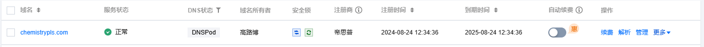

# Chemistry PLS 微信小程序

> “微瑞杯”第五届全国大学生化学实验创新设计大赛-实验数字化设计竞赛中的参赛作品的一部分

**Chemistry PLS 微信小程序** 项目旨在通过图像分析上传图片的RGB值，预测化学浓度和吸光度值，使用了偏最小二乘回归（PLS）模型。项目包含前端（微信小程序）和后端（Python Flask 服务器）组件。

## 目录

- [项目简介](#项目简介)
- [使用的技术](#使用的技术)
- [安装和设置](#安装和设置)
  - [后端设置](#后端设置)
  - [微信小程序设置](#微信小程序设置)
- [如何使用](#如何使用)
- [未来开发计划](#未来开发计划)
- [许可证](#许可证)

## 项目简介

Chemistry PLS 微信小程序通过分析用户上传的图片，提取出图片中心区域的RGB值，利用PLS回归模型识别出化学试剂的浓度和吸光度。前端由微信小程序实现，用户可以拍摄或上传图片，后端服务器基于PLS回归模型进行分析并返回结果。

## 使用的技术

- **前端**: 微信小程序
- **后端**: Python, Flask
- **模型**: 偏最小二乘回归（PLS）
- **服务器**: Nginx, Gunicorn
- **其他**: 腾讯云域名, SSL证书

## 安装和设置

### 后端设置

1. **克隆代码库**:
   
   ```bash
   git clone https://github.com/globe01/Chemistry_PLS_Wechat_Program.git
   ```
   
2. **进入项目目录并创建虚拟环境**:
   
   ```bash
   cd Chemistry_PLS_Wechat_Program
   python3 -m venv myenv
   source myenv/bin/activate
   ```
   
3. **安装依赖**:
   ```bash
   pip install -r requirements.txt
   ```

4. **启动Flask服务器**:
   ```bash
   gunicorn -w 4 -b 0.0.0.0:5000 app:app
   ```

### 微信小程序设置

1. 在微信开发者工具中导入小程序项目。
2. 配置域名为服务器域名（必须是HTTPS）。
3. 根据需求修改小程序图标和标题。

## 如何使用

1. **上传图片**: 用户打开小程序之后，可以当场拍摄或者选择已有的本地图片进行上传。
2. **预测**: 后端服务器会处理图片并返回预测的化学浓度或吸光度。
3. **查看结果**: 结果会在小程序中显示，并存储在历史记录中，点击历史记录可查看过去所有查询记录。

## 未来开发计划

- 优化模型性能。
- 增加更多化学试剂的支持。
- 增强用户界面体验。

## 许可证

> 使用腾讯云

- 域名（1年-75元）：chemistrypls.com, www.chemistrypls.com

  

- 轻量应用服务器（1年-216元）：

  

- 域名解析（1年-532元）：

  

- 微信认证（30元）